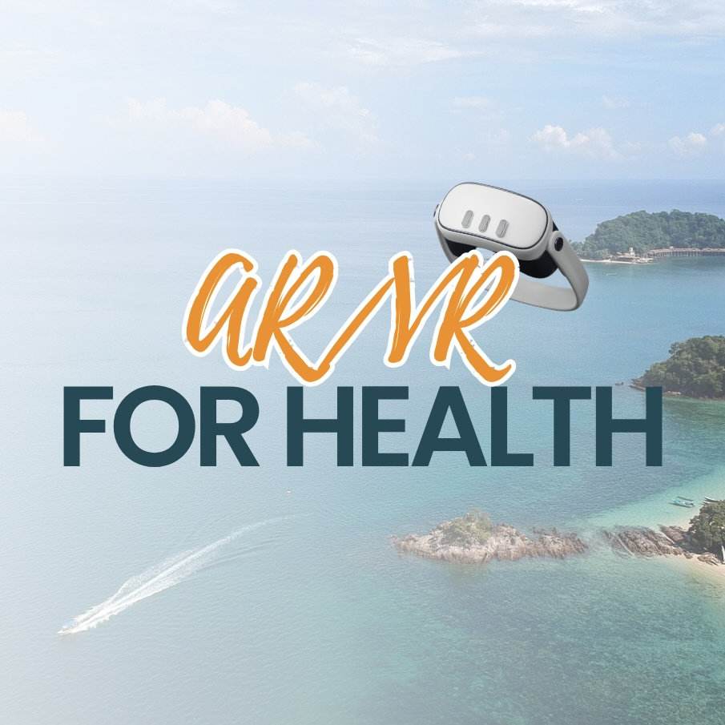

<!-- PROJECT LOGO -->
 

  

<h3 align="center">AR-VRHealth</h3>

  

    VR platform for neuroscience
     
    
    ·
    <a href="https://github.com/VRHealth/VRHealth/issues/new?labels=bug&template=bug-report---.md">Report Bug</a>
    ·
    <a href="https://github.com/VRHealth/VRHealth/issues/new?labels=enhancement&template=feature-request---.md">Request Feature</a>
  

# Welcome to README!
Thank you for visiting the Virtual Reality Neuroscience Health Platform project! Below you will find all the information you need to understand what this project is about, how to set it up, and how to contribute.

<!-- TABLE OF CONTENTS -->

  
Table of Contents

  <ol>
    <li>
      <a href="#about-the-project">About The Project</a>
      <ul>
        <li><a href="#built-with">Built With</a></li>
        <li><a href="#unity-installed-package">Unity Installed Package</a></li>
      </ul>
    </li>
    <!-- <li>
      <a href="#getting-started">Getting Started</a>
      <ul>
        <li><a href="#prerequisites">Prerequisites</a></li>
        <li><a href="#installation">Installation</a></li>
      </ul>
    </li> -->
    <li><a href="#team">Team</a></li>
    <li><a href="#acknowledgments">Acknowledgments</a></li>
  </ol>

<!-- ABOUT THE PROJECT -->
## About The Project
**Virtual Reality Cognitive Exercises**

Virtual reality (or VR) technology has emerged as a powerful tool in a variety of settings, offering immersive, controllable, and repeatable environments for both clinical interactions and experiements. The initial concept behind this project involved the creation of multiple environments intended to be used as private rooms used for therapy, shared by a professional and a patient. This time, the created environments were leveraged to be used in the design of various cognitive assessment tasks such as object localization and object recgonition. By simulating realistic scenarios in a safe and modifiable setting, VR allows researchers to investigate sensory perception, motor control, spatial navigation, memory, decision-making, and social interaction with high confidence.

(<a href="#welcome-to-readme">back to top</a>)

<!-- TEAM -->
## Team

#### Project Team Members:

- Ricki Ace G. Gaborno - rg42@hawaii.edu | [GitHub Profile](https://github.com/Rickiace)
- Austin Jake C. Villanueva - ajcv@hawaii.edu | [GitHub Profile](https://github.com/AustinV28)
- Justine A. Afaga - afagajus@hawaii.edu | [GitHub Profile](https://github.com/Jafaga)

#### Previous Project Team Members:

- Kurt Kimura - kurtkimu@hawaii.edu | [GitHub Profile](https://github.com/KurtKimura02)
- James Ligeralde - jligeral@hawaii.edu | [GitHub Profile](https://github.com/jligeral)
- Kye Steele - kss25@hawaii.edu | [GitHub Profile](https://github.com/kyesteele)

Project Link: [https://github.com/AR-VRHealth](https://github.com/AR-VRHealth)

(<a href="#welcome-to-readme">back to top</a>)

<!-- ACKNOWLEDGMENTS -->
## Acknowledgments

[Best-README Template](https://github.com/othneildrew/Best-README-Template)

(<a href="#welcome-to-readme">back to top</a>)

<!-- MARKDOWN LINKS & IMAGES -->
<!-- https://www.markdownguide.org/basic-syntax/#reference-style-links -->

[Unity]: https://img.shields.io/badge/Unity-ffffff?style=for-the-badge&logo=Unity&logoColor=000000
[Unity-url]: https://unity.com/
[React.js]: https://img.shields.io/badge/React-20232A?style=for-the-badge&logo=react&logoColor=61DAFB
[React-url]: https://reactjs.org/
[C#]: https://img.shields.io/badge/C_Sharp-563D7C?style=for-the-badge&logo=csharp&logoColor=white
[C#-url]: https://dotnet.microsoft.com/en-us/languages/csharp
[Github]: https://img.shields.io/badge/Github-20232A?style=for-the-badge&logo=Github&logoColor=ffffff
[Github-url]: https://github.com/

